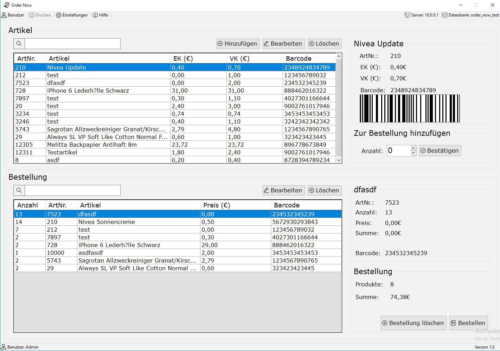
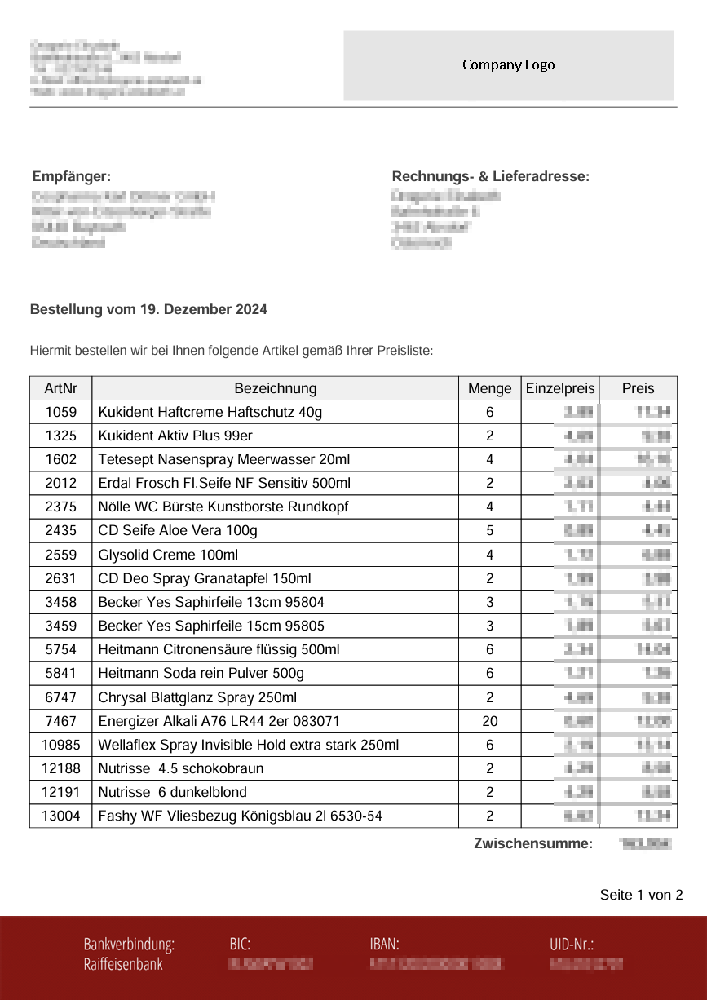

# Order Now

Order Now was one of my first full-featured desktop projects developed in C#. It provides a practical solution for managing product inventories and creating structured orders in a retail setting, such as pharmacies or small stores.

The application was implemented using C# for the user interface and business logic, while MySQL serves as the backend database for storing articles, prices, and order data. It is tailored for use with barcode scanners, allowing fast and accurate product selection through scanning or manual input.

In addition to product selection and order compilation, the application automatically generates a PDF document containing the complete order details. This document is then attached to an automatically generated email, making it ready for dispatch to the supplier.

Through this project, I gained practical experience in integrating external tools like PDF generation libraries and database systems into a desktop application built with Windows Forms.

## Technologies

  
  

## Features

### 💻 Screenshot of the application:

### 🧾 Product Overview
The upper table lists all available products from the database. Each entry includes an article number, name, purchase price, sales price, and barcode. Users can search products by typing or scanning a barcode.

After selecting a product, a detail view appears on the right. The user can enter a quantity and add it to the current order.

### 📦 Order Management
The bottom section displays the compiled order. Each row contains quantity, article number, product name, unit price, and barcode.

A side panel shows details of the selected item. A summary section at the bottom displays the total item count and final price.

### ⚙️ Settings

The application includes a settings section where the following options can be configured:

- **Email Message**: The default message body for outgoing order emails can be customized.
- **Database Connection**: Connection details for the MySQL database can be entered and updated.
- **Order Reset**: The current order can be cleared entirely with a single action.
- **Print Order**: The current order can also be printed directly from the application.

### 📤 Finalizing the Order: PDF & Email
Clicking “Place Order” generates a PDF summarizing the order. The file includes all line items, total amounts, and addresses.

This PDF is automatically attached to an email and sent to the preconfigured supplier.

#### 📄 Example of the Generated Invoice:

